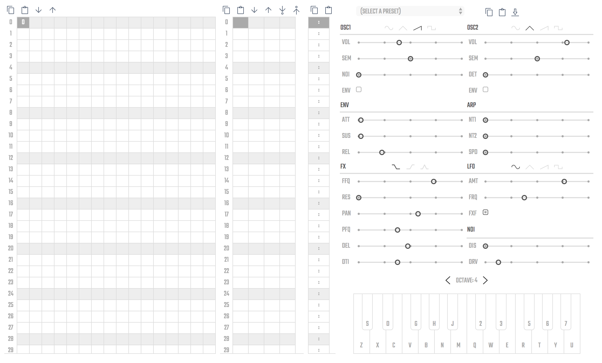

# Synt

Synt is an open music synthesizer and tracker that runs in the browser.

You can play it online [here](https://1jss.github.io/synt/).



## Running locally

To run Synt you need to use a local server.

On Mac and Linux you can start a Python SimpleHTTPServer from the terminal like this:

```bash
cd path/to/synt
python -m SimpleHTTPServer 8008
```

In Python 3:

```bash
cd path/to/synth
python -m http.server 8008

Then go to `http://localhost:8008/` in your web browser and play!

## License
Synt is built upon [SoundBox](https://github.com/mbitsnbites/soundbox) and is licensed under [GPL3](gpl.txt).
